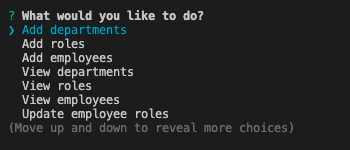
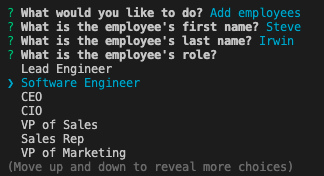
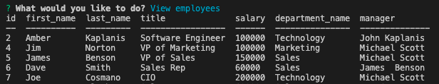

# Employee Tracker


## Description

This is a content management system used to manage a company's employees using node, inquirer, and MySQL.

## Table of Contents

- [Installation](#installation)
- [Usage](#usage)
- [Screenshots](#Screenshots)
- [License](#license)
- [Contributing](#contributing)
- [Questions](#questions)

## Installation

To install the dependencies, run the command below:

```
npm i
```

## Usage

Execute the schema in MySQL, run the command below in the terminal to start the app. Ensure that you enter a department and role before adding an employee.

```
node app.js
```

## Screenshots







## License

```
MIT
```

## Contributing

Create a Pull Request with a description and screenshots.

## Questions


If you have any questions about the repo, open an issue or contact [jkaplanis](https://github.com/jkaplanis) directly at [johntkaplanis@gmail.com](mailto:johntkaplanis@gmail.com).
